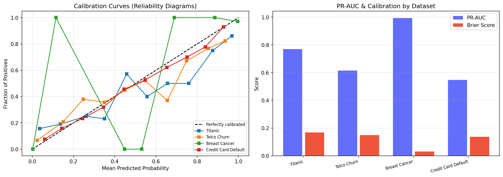

# Extended Evaluation Results

## Part 1: Regression Dataset — California Housing

| Metric | Single-Agent (LR) | Multi-Agent |
|---|---|---|
| RMSE | 0.7456 | 0.4470 |
| MAE | 0.5332 | 0.2936 |
| R-squared | 0.5758 | 0.8475 |

R-squared improvement: +0.2717

## Part 2: PR-AUC & Calibration Metrics

| Dataset | F1 | PR-AUC | Avg Precision | Brier Score | Pos% |
|---|---|---|---|---|---|
| Titanic | 0.6923 | 0.7687 | 0.7716 | 0.1683 | 38.6% |
| Telco Churn | 0.5476 | 0.6138 | 0.6149 | 0.1489 | 26.5% |
| Breast Cancer | 0.9726 | 0.9938 | 0.9939 | 0.0302 | 62.7% |
| Credit Card Default | 0.4658 | 0.5459 | 0.5462 | 0.1364 | 22.1% |



## Part 3: Formal Code Quality Definition

```
+============================================================================+
|                   FORMAL CODE QUALITY CRITERIA                             |
|         What counts as "semantically sound" LLM-generated pipeline code   |
+============================================================================+

Code is classified PASS if ALL of the following are met.
Any failure triggers the Critic self-correction loop (up to 3 iterations).

GATE 1 — EXECUTABILITY (Binary)
  [x] Runs end-to-end in E2B sandbox without exceptions
  [x] All imports resolve (no ModuleNotFoundError)
  [x] Output files produced: cleaned_data.csv, featured_data.csv,
      best_model.joblib, preprocessor.joblib, visualization_data.json

GATE 2 — DATA INTEGRITY (Binary per assertion)
  [x] Zero NaN/null values in output dataset
  [x] No duplicate columns
  [x] Target column present and numeric (0/1 for classification)
  [x] Row count within 10% of input (no catastrophic data loss)
  [x] No data leakage: preprocessing fitted ONLY on training split

GATE 3 — STATISTICAL VALIDITY (Threshold-based)
  [x] Primary metric (F1/R2) >= baseline (LogisticRegression/LinearRegression)
  [x] 5-fold CV std < 0.10 (pipeline stability)
  [x] No single fold deviates > 2 sigma from mean

GATE 4 — REPRODUCIBILITY (Binary)
  [x] random_state=42 on all stochastic operations
  [x] Stratified train/test split for classification
  [x] Identical results across 2 consecutive runs

GATE 5 — CRITIC SCORECARD THRESHOLDS (/10 scale)
  Category                    Minimum
  ------------------------------------
  Data Leakage Prevention        7/10
  Code Quality                   6/10
  Metric Alignment               7/10
  Feature Engineering Depth      5/10
  Model Selection                6/10
  Production Readiness           5/10
  OVERALL                        6.0/10

  OVERALL < 6.0 OR any category < 5  →  CRITICAL  →  re-iterate (mandatory)
  6.0 <= OVERALL < 7.5                →  MODERATE  →  re-iterate (recommended)
  OVERALL >= 7.5                      →  MINOR     →  pipeline complete

AGGREGATE QUALITY SCORE:
  "Passes quality bar" = Gates 1-4 all pass
                         AND Critic Overall >= 7.0/10
                         AND primary metric > baseline by >= 2%
+============================================================================+
```
